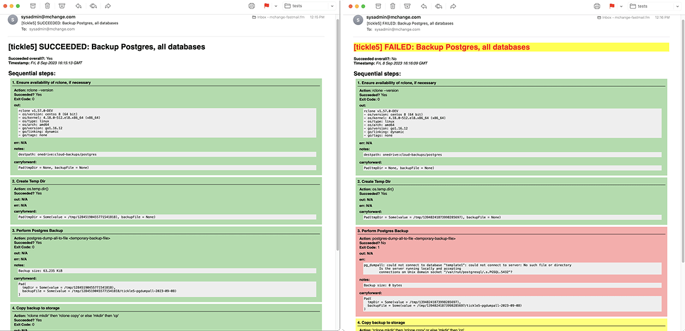

# mchange-sysadmin-scripts

This is an experiment in building sysadmin scripts in `Scala` using [`scala-cli`](https://scala-cli.virtuslab.org/) and `systemd`.
It makes use of the library [`mchange-sysadmin-scala`](https://github.com/swaldman/mchange-sysadmin-scala) for a variety of utilities,
in particular for its [`TaskRunner`](https://github.com/swaldman/mchange-sysadmin-scala/blob/main/sysadmin/src/com/mchange/sysadmin/TaskRunner.scala)
which models a sysadmin task as a pipeline of steps, and provides detailed reporting in logs and in
nicely-formatted, color-coded HTML mail:



([success.pdf](doc/media/backup-postgres-succeeded.pdf), [failure.pdf](doc/media/backup-postgres-failed.pdf))

Of course, plaintext reports are also generated for your logs (and as an `text/plain` alternate in the e-mails).

While you may find some of these scripts usable as-is, once you understand the set-up, it is easy to
customize and to write your own scala scripts that `systemd` will trigger and that will e-mail nice reports.

## Prerequisites

[`scala-cli`](https://scala-cli.virtuslab.org/) must be installed and available on `root`'s path.

This application is intended for linux machines running [`systemd`](https://systemd.io/).

## Installation

### 1. Clone this repository

It doesn't matter where so much. But this will be where your scripts and systemd units live their best, permanent
lives, so give it a few minutes of thought.

(If you want scripts as a particular version or tag, just use `git checkout <tag-or-commit>` to get the version you want.)

### 2. Configure the environment

1. Make the config directory. This directory will contain e-mail and perhaps database credentials, so set restrictive permissions.
   ```plaintext
   # mkdir /etc/mchange-sysadmin/
   # chmod go-rwx /etc/mchange-sysadmin/
   ```
2. Set up the file `/etc/mchange-sysadmin/mchange-sysadmin.env`:
   ```plaintext
   MCHANGE_SYSADMIN_SCRIPTS_HOME= # The directory into which you cloned this distribution
   SMTP_USER=                     # Your e-mail provider username
   SMTP_PASSWORD=                 # Your e-mail provider password
   SMTP_HOST=                     # Your e-mail provider's SMTP host
   SMTP_PORT=465                  # Your e-mail provider's SMTP port (if 587, probably set SMTP_STARTTLS to true)
   #SMTP_STARTTLS=false
   SMTP_DEBUG=false
   SYSADMIN_MAIL_FROM=            # The e-mail address sysadmin mail should be sent from
   SYSADMIN_MAIL_TO=              # The e-mail address sysadmin mail should be sent to

   # Optional
   PG_BACKUPS_DEST=               # If you'll use the backup-postgres script, an rclone destination to which to send backups
   MYSQL_ROOT_PASSWORD=           # The root password to your mysql installation
   MYSQL_BACKUPS_DEST=            # If you'll use the backup-mysql script, an rclone destination to which to send backups

   ```

### 3. Link service and timer unit files where `systemd` will find them

For example, if you want to use the `backup-postgres` script and you've cloned this distribution into `/usr/local`, then...

```plaintext
# cd /etc/systemd/system
# ln -s /usr/local/mchange-sysadmin-scripts/systemd/backup-postgres.service
# ln -s /usr/local/mchange-sysadmin-scripts/systemd/backup-postgres.timer
```

Of course, review the unit files, and edit them to suit. Perhaps you want postgres backed up more frequently, or less.

### 4. Test your service

It's just...

```plaintext
# systemctl start backup-postgres
```

To follow what's happening, and debug any problems:

```plaintext
# journalctl -u backup-postgres --follow
```

Once the script runs cleanly, you should see a report in the log, and receive a prettier one by e-mail
at the `SYSADMIN_MAIL_TO` address you've configured.

### 5. Install and instart your timer

For every script you want to be triggered automatically, you'll need to install and start a timer:

```plaintext
# systemctl enable backup-postgres.timer
# systemctl start backup-postgres.timer
```

Once that's done, verify the timer is set:

```plaintext
# systemctl status backup-postgres.timer
● backup-postgres.timer - schedule a weekly postgres backup
     Loaded: loaded (/etc/systemd/system/backup-postgres.timer; enabled; vendor preset: enabled)
     Active: active (waiting) since Tue 2023-09-05 18:24:40 UTC; 2 days ago
    Trigger: Mon 2023-09-11 06:10:39 UTC; 2 days left
   Triggers: ● backup-postgres.service
```

If there is a `Trigger` time, the timer is running.

That's it!

Link/test/install whichever scripts you want.

## Write your own scripts

Scala scripts that organize administrative tasks intio pipelines live in the [taskbin](taskbin) directory.
Check [`snapshot`](taskbin/snapshot) for a very simple example.
See the documentation for [mchange-sysadmin-scala](https://github.com/swaldman/mchange-sysadmin-scala) for details on
how to define a `TaskRunner` and its tasks.

Just write a script &mdash; which can and often does require command line arguments and/or environment vars &mdash;
to execute your task, using the default reporters.

Once you have defined your task, check out the `.service` and `.timer` files in [`systemd`](systemd).
It's very easy to follow the pattern and make new ones for your new task.

You can define traditional shell scripts as helpers, and place them in the [`bin`](bin) directory.
Very trivial shell scripts can dramatically simplify the Scala you might othewise need to write.

## Contributing

Consider maintaining a fork for your own additions and customizations.

Pull requests that include additions that might be broadly useful &mdash; or enhancements of or fixes to what is already here &mdash;
would be greatly appreciated.

## Miscellaneous notes

For a list of supported timezones, see `timedatectl list-timezones`.

---

_Note: This project is distinct from the venerable [mchange-admin](https://github.com/swaldman/mchange-admin) project, which is mostly
about ad-hoc package management._


