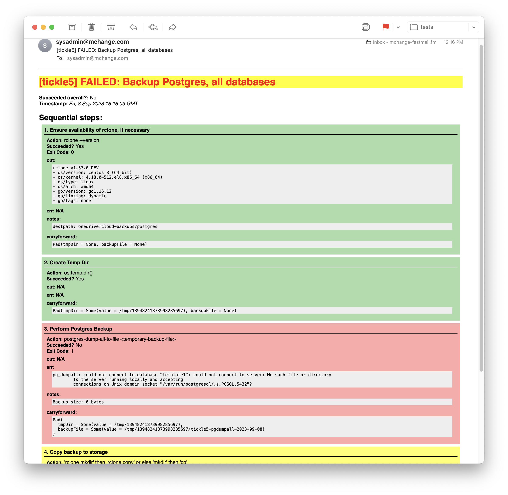

# mchange-sysadmin-scripts

This is an experiment in building sysadmin scripts in `Scala` using [`scala-cli`](https://scala-cli.virtuslab.org/) and `systemd`.
It makes use of the library [`mchange-sysadmin-scala`](https://github.com/swaldman/mchange-sysadmin-scala) for a variety of utilities,
in particular for its [`TaskRunner`](https://github.com/swaldman/mchange-sysadmin-scala/blob/main/sysadmin/src/com/mchange/sysadmin/TaskRunner.scala)
which models a sysadmin task as a pipeline of steps, and provides detailed reporting in logs and in
nicely-formatted, color-coded HTML mail:

 ([pdf](doc/media/backup-postgres-succeeded.pdf))Here's a failure ([pdf](doc/media/backup-postgres-succeeded.pdf)), looks pretty different!

While many installations could use some of these scripts as-is, once you establish the set-up, it will be easy to
customize and to write your own scala scripts that `systemd` will trigger and that will e-mail great reports.
So, let's get started!

## Installation

### 1. Clone this repository

It doesn't matter where so much. But this will be where your scripts and systemd units live their best, permanent
lives, so give it a few minutes of thought.

(If you want scripts as a particular version or tag, just use `git checkout <tag-or-commit>` to get the version you want.)

## Developer notes

For a list of supported timezones, see `timedatectl list-timezones`.

_Note: This is distinct from the venerable [mchange-admin](https://github.com/swaldman/mchange-admin) project, which is mostly
about ad-hoc package management._

